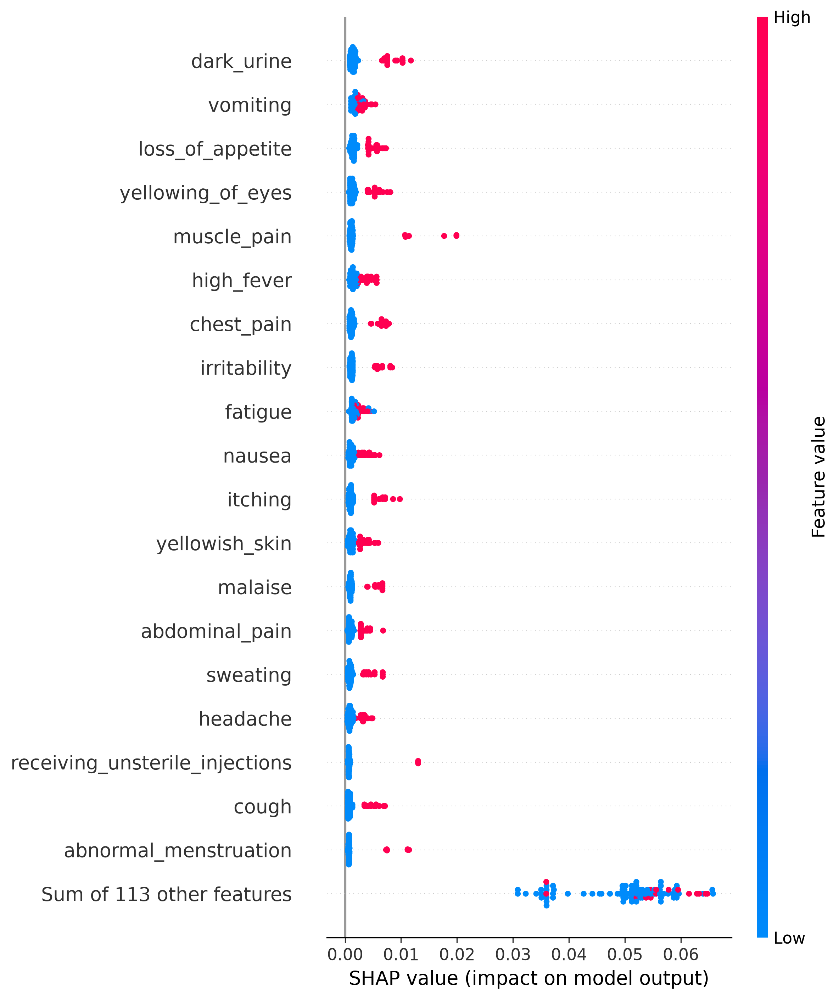
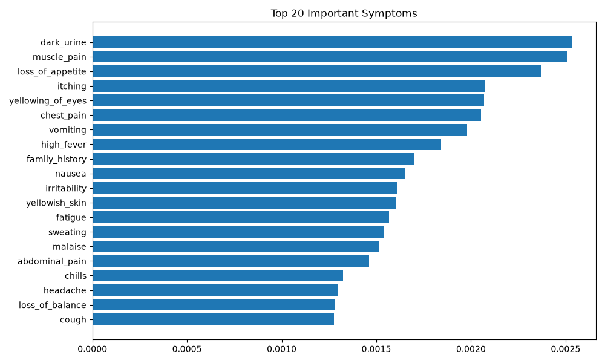

# Medical Symptoms Checker

This is a tool that helps figure out what is wrong with you when you are not feeling well. It uses computers to look at your symptoms and try to determine what disease you might have.

## Features

- This tool can try to predict what disease you have based on the symptoms you tell it

- You can tell it about 132 symptoms you are experiencing

- It can compare how well different computer models are at predicting diseases

- It can help explain why it thinks you have a certain disease

- It can show you which symptoms are most important in making its prediction

## How It Works

You tell it about your symptoms

↓

It gets your symptoms ready to use

↓

It uses a special computer model to try to predict what disease you have

↓

It tells you what disease it thinks you have

↓

It explains why it thinks you have that disease

## The Computer Model

The tool uses a special kind of computer model called a Random Forest Classifier.

It saves the model in files called:

- disease_model.pkl

- label_encoder.pkl

## How It Explains Its Predictions

It uses a tool called SHAP to help understand why it made a prediction.

For example it can show you pictures like this:

It can show you which symptoms are most important, like this:

## How To Use It

First you need to install some tools:

pip install -r requirements.txt

Then you can run the tool to get a prediction:

python predict.py

## What Is Next

- Make an more powerful version of the tool using something called FastAPI

- Use a special kind of computer model called LLM to help explain medical things

- Make a website where you can interact with the tool and get predictions easily
